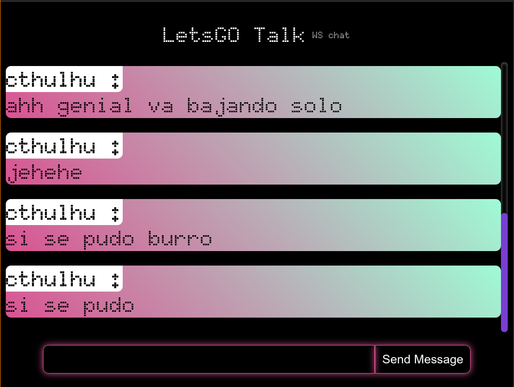

# Lets GO to Talk

### About it
This is a simple server and client to chat, using GOlang with [gorilla/websocket](https://github.com/gorilla/websocket) to create the service and the latest Angular version to create the client.

### Requirements
- [x] Permitir que múltiples usuarios se conecten al servidor y envíen mensajes.
- [x] Difundir los mensajes a todos los usuarios conectados.
- [ ] Identificar a los usuarios con un nombre único o un ID generado.
- [ ] Identificar las salas.
- [ ] Cambiar de sala a gusto.
- [ ] Persistencia de msg por sala.

```sh
#to run the service
go run cmd/main.go

#to run the client
cd client/clientws/ && npm run start
```


